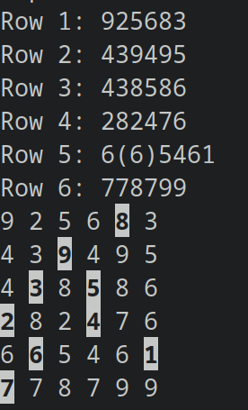

# Kyudoku solver

A solver for the game [Kyudoku](https://www.brainzilla.com/logic/kyudoku).

Game rules:
1. Nine tiles must be selected, each having a different number.
2. The sum of the selected tiles, row-wise and column-wise, must not be greater than 9.

